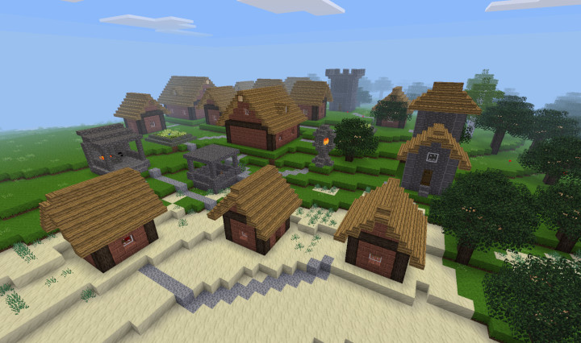
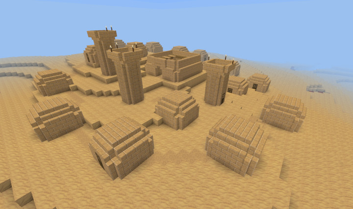
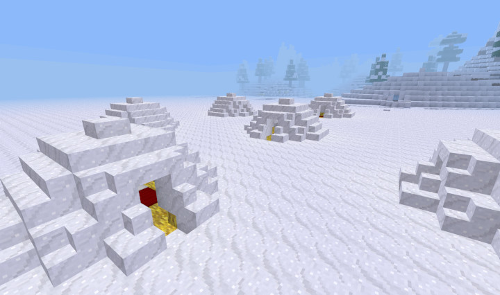
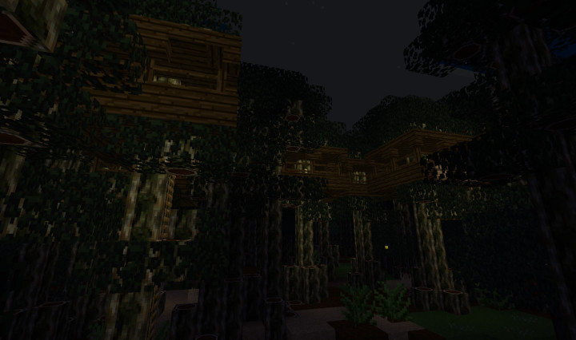

This mod adds settlements on world generation. The settlements consist of a cluster of small buildings whose construction sites blend into the contours of the world around them and which are connected by non-rectilinear gravel paths. They are the equivalent of small hamlets or thorpes, not grand villages or towns.

- [namegen](https://github.com/FaceDeer/namegen) is a recommended optional dependency, this gives each settlement a unique name.

## Types of settlements

With the exception of some optional commoditymarket node support, only nodes from the default minetest_game are used by the base schematics included in this mod.

The most common settlement type has a medieval flavour to it, with simple houses, blacksmiths, wells, churches, and fortified towers. The material used in the walls of each building is randomized to give each settlement a bit of unique feel. If the [commoditymarket](https://github.com/FaceDeer/commoditymarket) mod is installed, then some rare houses will have a Night Market hidden inside them. There are also more prominent trading posts with King's Markets.

Deserts have a unique settlement type featuring tall watchtowers and walled bazaars, which contain both Kings' Markets and Night Markets - commerce is a bit less constrained by the laws of the crown out in the shifting sand seas.

Deep arctic environments contain the occasional cluster of igloos, small islands of respite in a harsh climate. They are too small and isolated to have marketplaces.

Likewise, the deep jungles have platform villages hidden in the canopies of trees - hard to spot while walking through the dense foliage, best located at night when the light from their torches may be seen. These isolated tribes have no marketplaces either.

Underwater can be found small "huts" crafted from living coral, used by aquatic beings.

And out in the most inhospitabl wastes are the remains of old failed settlements, now known by dark names when they're known at all.

## Discovering settlement names

Settlements have names (generated via the "[namegen](https://github.com/FaceDeer/namegen)" mod) and when a player comes close to the center of each settlement it will be marked as having been "discovered" by that player. When a player is in possession of a mapping kit the locations of distant settlements that they know about will be marked with waypoints in their HUDs, allowing them to find their way back to places they've visited.

Another way to locate settlements is via the "Travel Guides" that brave citizens of the settlements have written in their journeys to neighboring settlements. Search the shelves found inside some settlement buildings for these tomes. The [north compass](https://github.com/FaceDeer/north_compass) mod may be useful to players for following the directions in these travel guides.

If there's been economic activity in the King's Market, ledgers recording some of the historical transactions may be found as well.

## Credits

This iteration of the mod was written in 2020 by FaceDeer

This mod is based on "settlements" by Rochambeau (2018)

Which was in turn based on "ruins" by BlockMen

## License

This mod is licensed under the MIT license.
